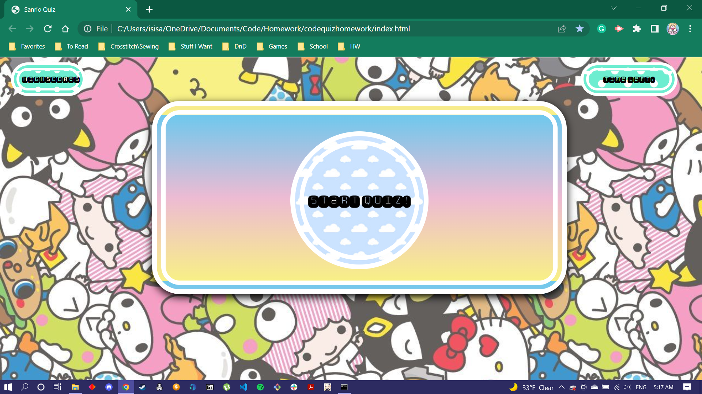

# Code Quiz Homework

## Description 

Here is a link to the deployed application on Github:

https://queenofbirbs.github.io/codequizhomework/

This is a finished homework assignment from the beginning of the bootcamp course. Though a little rough compared to my later works, I'm still quite fond of the CSS on it as it was challenging for me at the time it was made.

[](https://opensource.org/licenses/MIT)

## Table of Contents
- [Installation](#installation)
- [Usage](#usage)
- [Contributing](#contributing)
- [License](#license)
- [Questions](#questions)

## Installation

To run this application locally make sure to copy the files and then run ```npm install``` to have all of the correct dependencies. Otherwise please follow the link in the description or above to try out the deployed version yourself!

## Usage

This is largely for a homework assignment though feel free to look around! Made using HTML, Javascript and CSS. Made in April 2022.
Here is a screenshot of the application:




## Contributing

Isis Alexander (https://github.com/QueenOfBirbs)

## License

This application is covered under MIT license. 

## Questions

You can reach us at goddess.isis.alexander@gmail.com if you have any questions!

